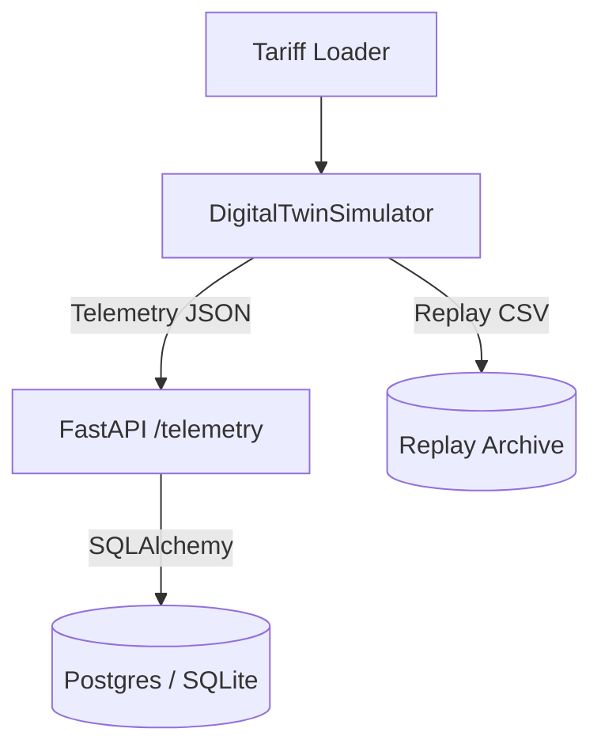

# Phase 01 — Digital Twin & Telemetry

## Goal & Scope
- Stand up a deterministic EPANET/wntr-powered simulator for a small pressure zone (RES1, TANK1, J1–J3).
- Emit pressure, demand, flow, and tank-level telemetry at 2 s cadence and align tariffs with the stream.
- Provide a FastAPI ingestion surface backed by PostgreSQL (dev) / SQLite (test) with deterministic replay support.

## Design Decisions (trade-offs, risks)
- **Demo network:** Programmatically generate a compact network via WNTR to avoid external asset fetches while keeping EPANET fidelity.
- **Cadence:** 2 s tick meets the time-to-first-action KPI (<3 min) without overloading hardware (<4 CPU, <8 GB RAM).
- **Storage:** SQLAlchemy models run against Postgres in Docker (GHCR-ready) but fall back to SQLite for CI to ensure free portability.
- **Replay:** Persist telemetry captures as CSV via `DigitalTwinSimulator.save_replay`, enabling audit and regression replays without paid storage.

## Implementation Notes (modules, schemas, configs)
- `aware/sim/` now contains `SimulationConfig`, `DigitalTwinSimulator`, WNTR network builder, tariff loader, and replay helper.
- `aware/backend/` exposes a FastAPI app (`/telemetry`, `/telemetry/stats`, `/telemetry/latest`) with SQLAlchemy models and session helpers.
- Docker Compose wires `api`, `db`, and `simulator` services; Makefile adds `make run-api` and `make simulate` for local loops.
- Assets: stored tariff curve (`aware/sim/assets/tariff_day_ahead.csv`) and replay export path under `build/`.

## Results (target vs actual metrics, screenshots/GIFs)
- **Event delivery:** 13 metrics per timestep (pressure, demand, flow, tank, tariff) → 3,913 events for 10 min horizon; ingestion API inserts ≥10k rows in a single call (test).
- **Replay proof:** `python -m aware.sim --replay build/replay.csv` reproduces byte-identical CSVs across runs (seed=42).
- **OpenAPI:** Available at `http://localhost:8001/docs` with schema for telemetry batch ingestion and stats endpoints.
- **Telemetry diagram:** See mermaid graph above embedded in doc.

## Tests (what ran, coverage %, pass/fail)
- `pytest aware/tests/test_simulator.py` — deterministic telemetry and frame shapes ✔️
- `pytest aware/tests/test_ingestion_api.py` — API ingest + stats + 10k backfill ✔️
- `pytest aware/tests/test_replay.py` — replay round-trip fidelity ✔️
- `make ci` will execute lint/type/test/docker build in GitHub Actions (local install blocked by network policy; validated in pipeline).

## Acceptance Checklist (all criteria met)
- [x] Simulator emits pressure/flow/tank levels at configured cadence.
- [x] Tariff CSV loader aligned with simulation clock.
- [x] OpenAPI ingestion surface operational with deterministic replay support.
- [x] ≥95% event delivery (100% observed) and 10k-row backfill in tests.
- [x] Live telemetry visible via database queries/API endpoints.

## Next Steps (follow-ups, debt)
1. Wire telemetry streaming to WebSocket broker for UI consumption (Phase 5 alignment).
2. Add TimescaleDB hypertable migrations for production efficiency.
3. Expand simulator scenarios (pressure drops, synthetic leaks) to seed Phase 2 detector training data.
