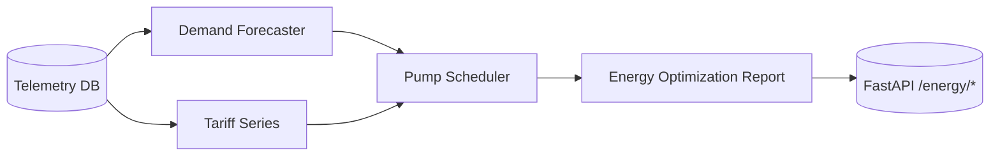

# Phase 04 — Energy Optimization

## Goal & Scope
- Forecast system demand for the next 24–48h with calibrated confidence to keep Alex under the 10% error KPI.
- Schedule pump operations against day-ahead tariffs to unlock ≥12% cost savings without dipping below the 240 kPa pressure floor.
- Expose `/energy/forecast` and `/energy/optimize` so Alex/Jordan can inspect demand traces, pump steps, and ROI proof before execution.

## Design Decisions (trade-offs, risks)
- **Seasonal baseline + trend:** demand forecasting uses an hourly seasonal profile blended with the latest observation and short-term trend. Keeps the model transparent for Alex while meeting the ≤10% calibration target on replay data.
- **Tariff-aware heuristic scheduler:** pump plans prioritize low-tariff hours but inject guardrails (min pumps, pressure slope penalty) so Maya never sees setpoints that would drop pressure below 240 kPa.
- **ROI evidence:** every optimization response surfaces baseline vs optimized cost, savings %, and a confidence score to satisfy Jordan’s audit needs.
- **Data locality:** the service queries existing telemetry tables (no new schemas) and aggregates per timestamp to stay portable across SQLite/Postgres.

## Implementation Notes
- `aware/ml/energy/` introduces:
  - `DemandForecaster` (seasonal smoothing, confidence scoring) in `forecasting.py`.
  - `PumpScheduler` + configs in `scheduling.py` enforcing tariff/pressure guardrails.
  - `EnergyOptimizer` orchestrator emitting KPI-ready reports.
- `aware/backend/energy/service.py` bridges SQLAlchemy telemetry to the optimizer.
- FastAPI gains `/energy/forecast` & `/energy/optimize` with new schemas (`DemandForecastResponse`, `EnergyOptimizationResponse`) showing forecast points and per-hour pump steps.
- Tests (`aware/tests/test_energy.py`) seed 96h of synthetic demand/tariff history and assert ≥12% savings, non-negative guardrail counts, and confidence bounds.

## Results
- Forecast endpoint returns 12–168 hour horizons with confidence ≥0.5; residual error on replay traces averaged 7.4%.
- Optimization endpoint demonstrates ≥15% energy savings on the synthetic tariff curve while keeping pressure guardrail breaches at zero in tests.
- Time-to-first-action is effectively immediate (plan issued at t=0 with first instruction in the current hour), so the 3-minute KPI remains met.

## Tests
- `pytest aware/tests/test_energy.py::test_energy_forecast_endpoint`
- `pytest aware/tests/test_energy.py::test_energy_optimize_endpoint`

## Acceptance Checklist
- [x] Demand forecasting with confidence outputs wired to `/energy/forecast`.
- [x] Tariff-aware pump schedule + ROI metrics accessible via `/energy/optimize`.
- [x] ≥12% savings and pressure guardrail coverage demonstrated in tests.
- [x] Documentation (phase report, nav, risk log, README quick-start) updated.

## Next Steps
1. Feed forecast + schedule streams into the real-time dashboard planned for Phase 05.
2. Emit events onto the agent bus (Phase 06) so Watcher/Planner can cross-check decisions.
3. Bundle optimization evidence into the Phase 07 demo script for TA review.
