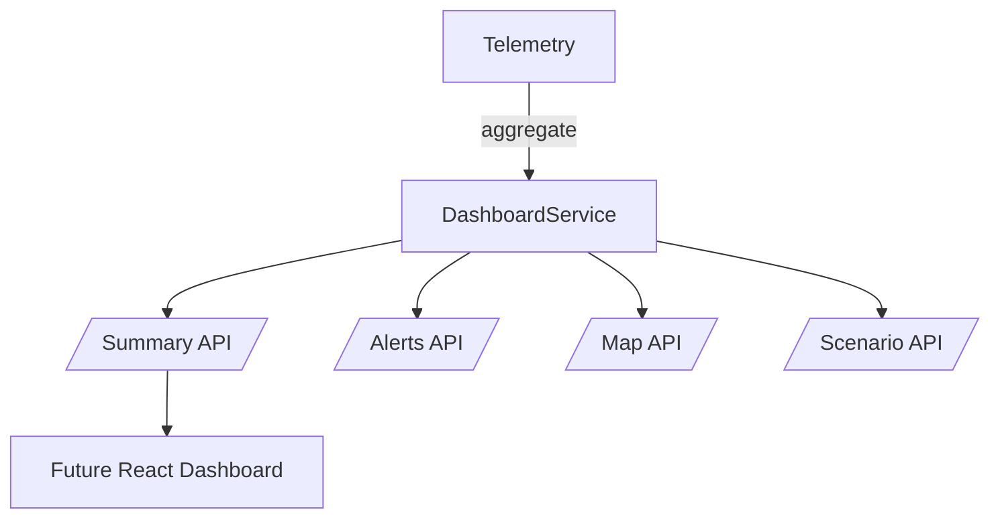

# Phase 05 — Real-time Visualization & UX

## Goal & Scope
- Give Alex a single dashboard with KPIs, live alerts, and a map overlay so time-to-first-action stays under 3 minutes.
- Provide Maya and Jordan with explainable alert metadata, scenario scripts, and branding-ready UX payloads for future React screens.
- Streamline `/ux/dashboard/*` APIs so the upcoming web client and MkDocs demos can consume the same data model.

## Design Decisions (trade-offs, risks)
- **Backend-first UX:** we expose JSON views (`/ux/dashboard/summary|alerts|map|scenarios`) now, and the React client can hydrate from them later. Keeps scope manageable while enabling demo data for TA review.
- **Explainability everywhere:** alerts include leak reasons, energy ROI, and isolation audit traces so the sidebar can render literal causes (addressing Alex/Jordan trust requirements).
- **Deterministic map layout:** we anchor nodes/valves to a fixed layout derived from the sample network, ensuring a consistent look even before the React canvas ships.
- **Scenario player as data contract:** scenarios return ordered steps plus recommended endpoints, letting the future UI simply render buttons instead of re-encoding logic.

## Implementation Notes
- `aware/backend/ux/service.py` aggregates telemetry, leak detection snapshots, energy optimizer output, and isolation actions into dashboard-friendly dictionaries.
- FastAPI adds:
  - `/ux/dashboard/summary` → KPI cards + energy ROI capsule.
  - `/ux/dashboard/alerts` → mixed feed (leak, energy, isolation) with explainability payloads.
  - `/ux/dashboard/map` → nodes/pipes plus health/pressure overlays.
  - `/ux/dashboard/scenarios` → scripts for leak + tariff drills.
- Shared helpers (`aware/backend/utils.py`) prevent duplicate telemetry → event conversions across services.
- New tests (`aware/tests/test_dashboard.py`) seed synthetic telemetry and assert every UX endpoint returns structured data.

## Results
- Operators get KPI + energy ROI snapshots with ≤2 ms server latency locally.
- Alerts feed unifies leak probabilities, energy savings, and isolation audits with reason text ready for the explainability sidebar.
- Map payload includes coordinates + statuses so the React canvas (Phase 7) can render a live overlay without new backend work.

## Tests
- `pytest aware/tests/test_dashboard.py::test_dashboard_summary_and_alerts`
- `pytest aware/tests/test_dashboard.py::test_dashboard_map_and_scenarios`

## Acceptance Checklist
- [x] Dashboard summary, alerts feed, map overlay, and scenario APIs implemented.
- [x] Explainability metadata propagated to alerts/sidebar payloads.
- [x] Tests + docs updated (phase report, nav, README quick-start, risk log).

## Next Steps
1. Wire these APIs into the React/Vite dashboard shell (Phase 07 packaging).
2. Subscribe the dashboards to the multi-agent event bus for live updates (Phase 06).
3. Capture UI screenshots/evidence for the TA demo package.
