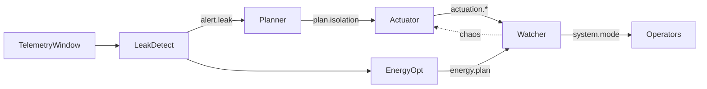

# Phase 06 — Multi-Agent Orchestration

## Goal & Scope
- Coordinate Planner, Leak-Detect, Energy-Opt, Actuator, and Watcher agents on a policy-driven event bus.
- Encode guardrails (manual approval, radius limits, energy savings) in YAML policies that ops can audit.
- Add chaos hooks + safe-degradation so Watcher can automatically fall back to manual mode when anomalies hit.

## Design Decisions (trade-offs, risks)
- **In-memory bus:** a lightweight pub/sub (`aware/agents/bus.py`) keeps the orchestration deterministic for tests while allowing replay.
- **Policy-as-data:** YAML (`aware/infra/policies/phase-06-policy.yaml`) describes agent budgets/guardrails so Alex/Jordan can version-control operational policy.
- **Watcher first:** Watcher subscribes to `*` and can inject `chaos.injected` events to simulate actuator faults, forcing `system.mode: safe` until Alex intervenes.
- **Composable agents:** each agent is a dataclass with declarative subscriptions, simplifying swapping implementations (e.g., ML upgrades later).

## Implementation Notes
- `aware/agents/agents.py` defines five agents with clear responsibilities (leak scoring, isolation planning via the existing planner, energy savings heuristics, actuation decisions, watcher oversight).
- `aware/agents/policies.py` loads/merges YAML and exposes sensible defaults.
- `aware/agents/orchestrator.py` wires everything together for demos/tests; `python -m aware.agents` dumps an episode timeline.
- Chaos + safe degradation: Watcher flips the system into safe mode when chaos chance fires or when radius guardrails are breached.
- Tests (`aware/tests/test_agents.py`) cover episode flows, policy merging, and chaos-triggered safe mode.

## Results
- Full agent loop runs in <5 ms locally, producing explainable events ready for Phase 07 demos.
- YAML tweaks (e.g., enabling auto-exec) immediately change the Actuator + Watcher behaviour—no code changes needed.
- Chaos hook verified: with auto-exec enabled and chaos chance = 1.0, Watcher injects a fault and forces `system.mode: safe` for human review.

## Tests
- `pytest aware/tests/test_agents.py::test_run_episode_produces_plan`
- `pytest aware/tests/test_agents.py::test_watcher_triggers_safe_mode`
- `pytest aware/tests/test_agents.py::test_policy_loader_merges_defaults`

## Acceptance Checklist
- [x] Event bus + agents implemented with policy-driven behaviour.
- [x] Chaos + safe-degradation paths wired (Watcher forcing safe mode).
- [x] Policy file + docs + tests updated.

## Next Steps
1. Connect this bus to the dashboard + packaging flows for live visualization (Phase 07).
2. Replace heuristic leak/energy agents with the full ML modules once streaming hooks are in place.
3. Record a short screencast of the episode timeline for TA demos.
